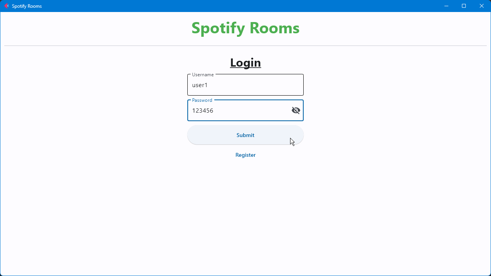
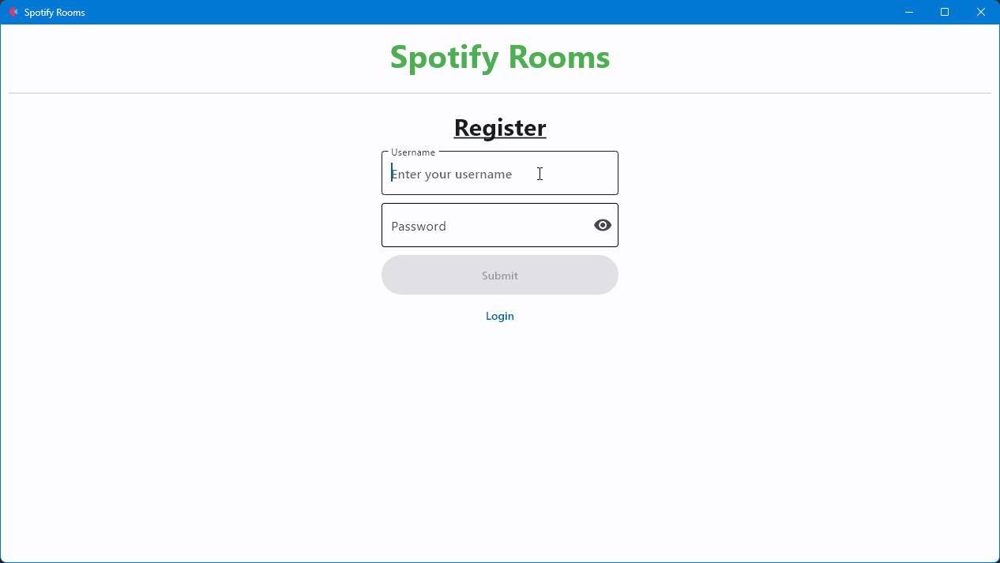
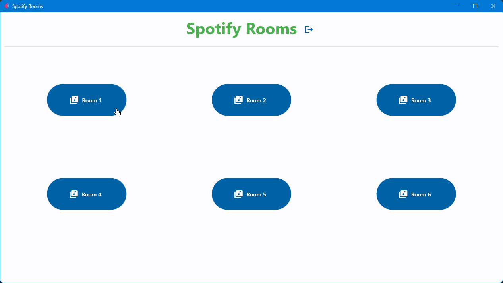
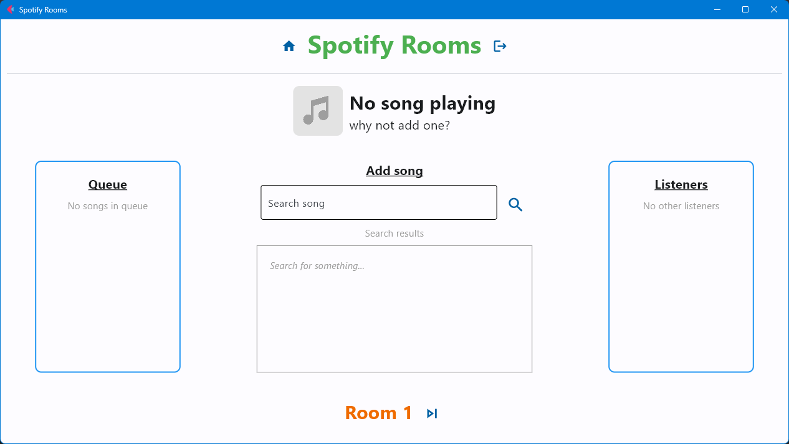
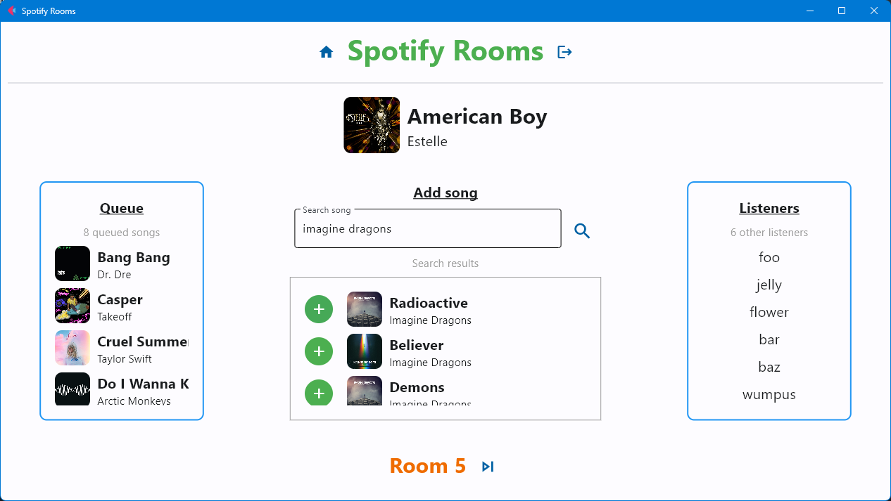

# 🎶 Spotify Rooms

A multiplayer app that allows users to move between rooms and listen to music together.
Every room has its own queue and anyone can add songs to it.

> [!NOTE]  
> The UI was with [`❤️ Flet`](https://flet.dev/)  
> I Also used [`🎵 Spotipy`](https://spotipy.readthedocs.io/) (spotify api) and [`🐍 Pygame`](https://www.pygame.org/) (audio)

---

## 🐍 Features

- A functional UI for the app that includes:
  - Register & Login & Logging out
  - Viewing rooms list
  - Viewing current room participants (listeners)
  - Viewing queue
  - Searching for songs and adding to queue
  - Skipping a song
  - Audio is played in the background

- A protocol to talk between the client and the server that includes:
  - User authentication (auth codes)
  - Sending structured data and raw data!
  - Storing the users in a database (sqlite)

---

# 📷 Preview

---

## 🪢 Protocol

#### [size 4 bytes][who 1 byte][type 1 byte][api route 4 bytes][json/raw size header - 5…]

**Who:**

- c (Client to Server)
- s (Server to Client)

**Type:**

- 0 (json - the way to transfer data)
- 1 (raw - ie: files…)
- 2 (error - in a JSON format {“error_code”: _, “error”: “...”})

#### Protocol in Code

The server has a function that handles all of the valid
routes (SERVER_ROUTES). After handling a route it sends
a response to the client, which handles the response of
the server, though usually it doesn’t followup with a new message (but it can).

## ⌚ API Routes

| ROUTE | NAME         | INPUT              | OUTPUT                                                  |
|-------|--------------|--------------------|---------------------------------------------------------|
| RGST  | Register     | username, password | creates an account + returns auth                       |
| LOGN  | Login        | username, password | returns auth token                                      |
| ROOM  | Room Details | auth, room id      | returns room details (queue, listeners, current played) |
| JOIN  | Join Room    | auth, room id      | \---                                                    |
| LEAV  | Leave Room   | auth               | \---                                                    |
| SONG  | Search Song  | auth, query        | returns search results from spotify                     |
| RQUE  | Queue Song   | auth, song id      | \---                                                    |
| RSKP  | Skip Song    | auth               | \---                                                    |
| RCUR  | Get Current  | auth               | returns current played song file                        |

